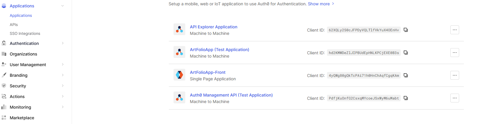
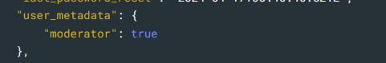
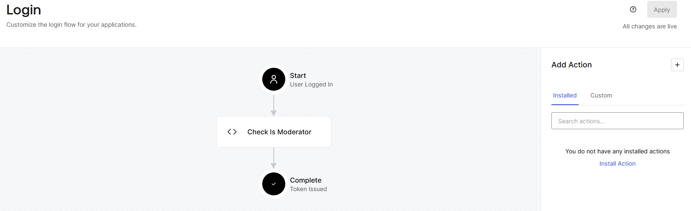

## Diverses Configurations initiales

- Configuration de Tailwinds sur le container docker
```docker exec artfolio-frontend-main npm install -D tailwindcss postcss autoprefixer```
```docker exec artfolio-frontend-main npx tailwindcss init -p```

- Configuration de de vue-router sur le container docker
```docker exec artfolio-frontend-backoffice npm install vue-router@4```

- Ajout de headlessui
```npm install @headlessui/vue@latest```

- Ajout de auth0
```npm install @auth0/auth0-vue```


# frontend-backoffice

Cette application permet d'accéder à un dashboard admin pour avoir une fonction de modération des utilisateurs de la plateforme. 

## Domain Auth0 
Le système d'autentification utilise Auth0 sur le domaine *dev-03ri6j5f0csn4op2*

### Pourquoi Auth0 ? 
 Raison d'utilisation d'un service externe pour l'application ArtFolio

 - **Sécurité renforcée** : Auth0 prend en charge les meilleures pratiques de sécurité telles que l'authentification à deux facteurs (2FA), la gestion des mots de passe, la protection contre les attaques par force brute. 

 - **Rapidité d'implémentation** : Auth0 fournit des SDK et des bibliothèques pour nos stacks choisies : Vue.Js et Node. La documentation est aussi très bien réalisée permettant une facilité d'implémentation. 

 - **Gestion des identités** : Auth0 prend en charge l'authentification et l'autorisation des utilisateurs, des appareils et des API, vous permettant de gérer toutes les identités au même endroit. On peut ainsi donner accès à notre API interne selon les identités et rôles définis sur Auth0 

 - **Analytique et suivi**: Auth0 fournit des fonctionnalités d'analyse et de suivi pour suivre les activités d'authentification, surveiller les performances et détecter les anomalies de sécurité.

- **Mise à disposition d'un Auth0 API Manager** : AUth0 dispose de sa propre API en mettant une place une Machine to Machine qui nous permet de gérer les utilisateurs depuis notre propre dashboard par appel d'API interposé. 

- **Possibilité de mise en place d'Actions** : Auth0 permet de mettre en place des actions en fonction des différentes étapes de l'authentification ce qui nous permet de vérifier des paramètres supplémentaires ou métadata avant de donner accès à notre plateforme. 

### Comprendre les différents clients

Le dashboard admin se situe à cette addresse : https://manage.auth0.com/dashboard/eu/dev-03ri6j5f0csn4op2/applications

Il dispose d'applications et d'API. 
L'application principale est ArtFolioApp-Front (Single Page App). Elle donne accès à l'API ArtFolioAPP via ce qu'on appelle une audience (adrresse url de l'API à renseigner dans la configuration de l'application)



Il y a une autre application (Machine to Machine) qui permet de donner accès à Auth0 Management API

Le dashboard admin a accès et à l'API de l'application et à l'API Management de Auth0. Le but étant que lorsqu'on supprime un utilisateur, qu'il soit supprimé dans notre backend ainsi que sur Auth0. 

### Mise en place d'une Action 

N'importe quel utilisateur peut créer son compte et ensuite accéder à l'application si aucun contrôle n'est effectué. Cela pose un problème sur le dashboard admin car on ne veut que des modérateurs qui puissent accéder au dashboard. 

Pour cela nous mettons en place des metadata supplémentaires dans les profils utilisateurs. Les modérateurs disposent d'un champ : <code>moderator : true </code>



L'action est ensuite codée pour vérifier ce champs et placée comme hook dans la plateforme de Auth0 : 



Si la metadonnée n'est pas vérifiée, alors l'accès est refusé. La métadonnée se modifie dans le dashboard Admin de Auth0 directement. 

la librairie vue/auth0 permet ensuite de créer une instance de auth0 qui pourra récupérer les informations de l'utilisateur et aussi générer un token qui donnera accès à l'API avec des méthodes clés en main.


